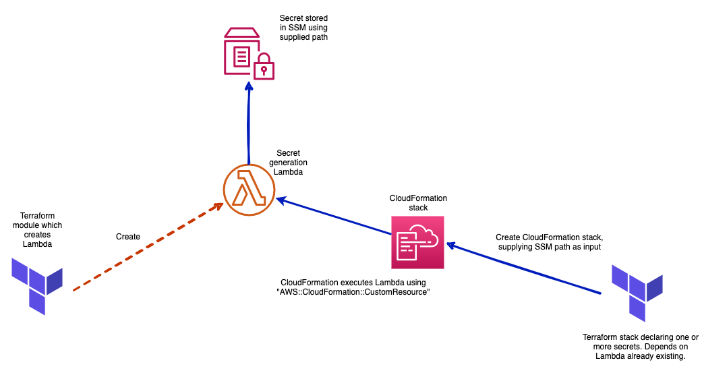

# Secrets Generator Lambda

This module creates a lambda which generates a secret value and stores the value in SSM. The module requires npm to be installed.

Once the lambda generated by this module is in place, the lambda can be used as part of a solution to generate secrets and store them in SSM. This is achieved by using this module in conjunction with the [aws-secret](https://registry.terraform.io/modules/Adaptavist/aws-secret/module/latest) module. The benefit of this approach is that secrets can be managed by Infrastructure as code (IaC) and secrets will never be leaked into the remote state or the CI/CD tooling context. The Lambda supports importing of existing secrets into IaC.

## How it works

This module creates a Lambda which processes the required events for a CloudFormation [custom resource](https://docs.aws.amazon.com/AWSCloudFormation/latest/UserGuide/template-custom-resources-lambda.html), the custom resource events which follow a CRUD like operation are mapped to a secret. So the create event populates the secret in SSM and delete removes the secret for example. 

Then, the [aws-secret](https://registry.terraform.io/modules/Adaptavist/aws-secret/module/latest) module creates a CloudFormation stack which sets up the custom resource. When its created for the first time the secret will be populated in SSM and the CloudFormation stack will be added to the Terraform remote state. Thereafter the secret is managed in the normal way Terraform modules are managed. If the reference to the secret using the module is removed it will cascade the Terraform destroy to the CloudFormation stack which in term triggers a delete event to the custom resource which invokes the Lambda with a delete event. 

See the below diagram which outlines the creation of a secret. 

## Variables
| Name | Description | Type | Default | Required |
|------|-------------|------|---------|:-----:|
| lambda\_name | Name given to the Lambda which generates secrets | `string` | `"ssm-secret-generator"` | no |
| namespace | Namespace used for the Lambda, this is used for tagging and within the Lambda name | `string` | n/a | yes |
| stage | The stage of the distribution - (dev, staging etc). | `string` | n/a | yes |
| tags | Tags applied to the distribution, these should follow what is defined [here](https://github.com/Adaptavist/terraform-compliance/blob/master/features/tags.feature). | `map(string)` | n/a | yes |

## Outputs

| Name | Description |
|------|-------------|
| lambda\_name | Name given to the lambda |

